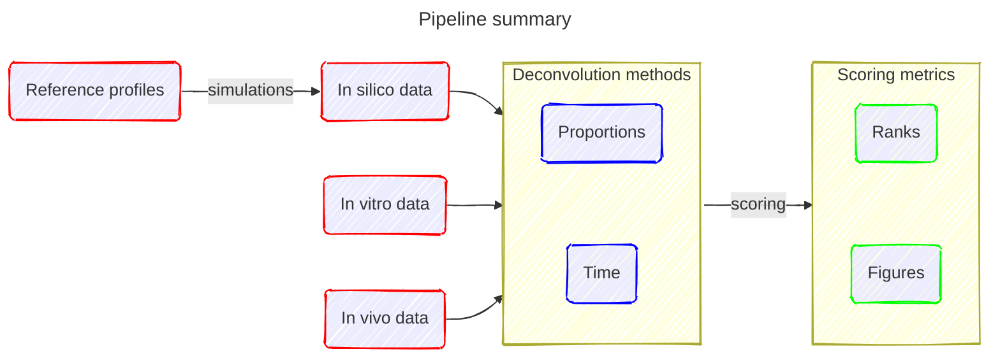

# A robust workflow to benchmark deconvolution of multi-omic data

This repository contains all the scripts and files needed to perform deconvolution and ranking on example datasets, along with the scripts to reproduce the figures of the paper.
Our pipeline can easily be extended to include and evaluate novel methods, as well as other datasets.



## How to make in silico data: folder [data](data/)

Shortly, we prepared in silico data using reference profiles of pure cell types from different tissues, as well as labelled and "pseudo-bulk-ised" scRNAseq data, convoluted with proportions generated based on a Dirichlet distribution. The scripts are in [simulation_scripts](data/simulation_scripts/), and the reference profiles can be downloaded from Zenodo (DOI 10.5281/zenodo.15835454).

The folder [data](data/) has the following architecture:
```
.
├── simulation_scripts
│   ├── generate_simu_DATA1.R
│   └── generate_simu_DATA2.R
├── references
│   ├── DATA1.rds
│   ├── DATA2_dnam.rds
│   └── DATA2_rna.rds
│   └── DATA3_sc.rds
├── simulations
│   ├── dnam
│   │   ├── 240101_DATA1_sim01.rds
│   │   ├── 240101_DATA1_sim02.rds
│   │   ├── 240101_DATA2_sim01.rds
│   │   └── 240101_DATA2_sim02.rds
│   ├── rna
│   │   ├── 240101_DATA2_sim01.rds
│   │   └── 240101_DATA2_sim02.rds
├── invitro
│   ├── DATA1_A.rds
│   ├── DATA1_D_dnam.rds
│   └── DATA2_A.rds
...
```

For example, to generate the simulations for the BrCL1 dataset, load the references from Zenodo, put them in the folder data/references/, and run:
```shell
cd data
mkdir -p simulations/rna simulations/dnam
cd simulation_scripts
Rscript generate_simu_BrCL1.R
```

This is also where we store the *in vitro* and *in vivo* datasets: ```data/invitro/DATA_A.rds``` for the proportion matrix and ```data/invitro/DATA_D_OMIC.rds``` for the methylation/expression matrix. Please refer to the table [here](data/README.md) for the instructions on where to download *in vitro* and *in vivo* data.

## How to run the deconvolution methods: folder [deconvolution](deconvolution/)

This pipeline uses an Apptainer container (previously Singularity) and Snakemake. Instructions on how to use these tools can be found [here](deconvolution/README.md) and [here](deconvolution/container.md).

Briefly, this folder contains the scripts to perform the deconvolution pipeline. There is one script per setting (class of the method/omic type). Those scripts can be modified to include new methods and/or new datasets (cf [README](deconvolution/README.md)).

To build the container and run this pipeline, and after creating a virtual environment YOUR_VENV with snakemake installed on it, you can run (update the DATE parameter in the Snakefile with the date of your simulations and the PATH of the --bind argument in the SHELL command of the Snakefile):
```shell
cd deconvolution
sudo apptainer build container2.sif container2.def
mkdir -p results/prediction/rna/sup results/prediction/rna/unsup results/prediction/dnam/sup results/prediction/dnam/unsup results/timing/rna/sup results/timing/rna/unsup results/timing/dnam/sup results/timing/dnam/unsup
conda activate YOUR_VENV
snakemake --latency-wait 60 --cores 1 --jobs 50
```

Snakemake will run all methods for all omics. To run the RNA methods that require TPM normalization (OLS, NNLS, SVR), the file with gene lengths "human_lengths.rds" is available upon request from the authors.
The [Snakefile](deconvolution/Snakefile) is self-explanatory and can be modified to include new methods/datasets. In general, you can refer to the [README](deconvolution/README.md) for explanations on how to test new methods/datasets.

Results of the deconvolution, *i.e.* estimation of the proportion matrix along with elapsed time will be stored in ```deconvolution/results/prediction/OMIC/CLASS/``` for the proportion matrix and ```deconvolution/results/timing/OMIC/CLASS/``` for the time elapsed with the syntax ```240101_DATA1_Apred_FS_METHOD_sim01.rds``` / ```240101_DATA1_timing_FS_METHOD_sim01.rds``` (FS being the feature selection strategy and METHOD the deconvolution algorithm).

## How to do the ranking and reproduce the figures of the paper: folder [ranking_figures](ranking_figures/)

(a) First, you can compute the different metrics (in our case, RMSE, MAE and Pearson correlation coefficients): just run the script [compute_scores.R](ranking_figures/compute_metrics/compute_scores.R) and the scores will be stored in ```compute_metrics/scores/```: one file for the time (```..._time.rds```) and one file for the other metrics (```..._scores.rds```)

To compute those metrics, simply run (with the date of your simulations in the compute_scores.R script):
```shell
cd ranking_figures/compute_metrics
mkdir scores
Rscript compute_scores.R
```

(b) The different figures of the paper can then be reproduced. For example, any figure can be done by running:
```shell
cd ranking_figures/figures/main_figs
mkdir FIG_NAME
Rscript FIG_NAME.R
```

## Session info
```R
> sessionInfo()
R version 4.2.0 (2022-04-22)
Platform: x86_64-apple-darwin17.0 (64-bit)
Running under: macOS 14.1

Matrix products: default
LAPACK: /Library/Frameworks/R.framework/Versions/4.2/Resources/lib/libRlapack.dylib

locale:
[1] en_US.UTF-8/en_US.UTF-8/en_US.UTF-8/C/en_US.UTF-8/en_US.UTF-8

attached base packages:
 [1] grid      stats4    parallel  stats     graphics  grDevices utils    
 [8] datasets  methods   base     

other attached packages:
 [1] fmsb_0.7.6                             
 [2] tibble_3.2.1                           
 [3] funkyheatmap_0.5.0                     
 [4] ggtext_0.1.2                           
 [5] ComplexHeatmap_2.12.1                  
 [6] circlize_0.4.15                        
 [7] ggpubr_0.6.0                           
 [8] RnBeads_2.14.0                         
 [9] plyr_1.8.9                             
[10] methylumi_2.42.0                       
[11] minfi_1.42.0                           
[12] bumphunter_1.38.0                      
[13] locfit_1.5-9.8                         
[14] iterators_1.0.14                       
[15] Biostrings_2.66.0                      
[16] XVector_0.38.0                         
[17] SummarizedExperiment_1.28.0            
[18] MatrixGenerics_1.10.0                  
[19] FDb.InfiniumMethylation.hg19_2.2.0     
[20] org.Hs.eg.db_3.15.0                    
[21] TxDb.Hsapiens.UCSC.hg19.knownGene_3.2.2
[22] GenomicFeatures_1.48.4                 
[23] AnnotationDbi_1.58.0                   
[24] reshape2_1.4.4                         
[25] scales_1.3.0                           
[26] illuminaio_0.38.0                      
[27] limma_3.54.2                           
[28] gridExtra_2.3                          
[29] fields_15.2                            
[30] viridisLite_0.4.2                      
[31] spam_2.10-0                            
[32] ff_4.0.9                               
[33] bit_4.0.5                              
[34] MASS_7.3-60                            
[35] GenomicRanges_1.50.2                   
[36] GenomeInfoDb_1.34.9                    
[37] IRanges_2.32.0                         
[38] S4Vectors_0.36.2                       
[39] RUnit_0.4.32                           
[40] gplots_3.1.3                           
[41] gtools_3.9.5                           
[42] pracma_2.4.4                           
[43] Rcpp_1.0.12                            
[44] cluster_2.1.4                          
[45] rngtools_1.5.2                         
[46] registry_0.5-1                         
[47] Biobase_2.58.0                         
[48] BiocGenerics_0.44.0                    
[49] foreach_1.5.2                          
[50] see_0.8.1                              
[51] ggplot2_3.5.0                          
[52] tidyr_1.3.1                            
[53] matrixStats_1.2.0                      
[54] dplyr_1.1.4                            

loaded via a namespace (and not attached):
  [1] pander_0.6.5              pbapply_1.7-2             lattice_0.21-9           
  [4] rJava_1.0-6               fontquiver_0.2.1          vctrs_0.6.5              
  [7] fastICA_1.2-3             beanplot_1.3.1            blob_1.2.4               
 [10] survival_3.5-7            dynutils_1.0.11           spatstat.data_3.0-3      
 [13] later_1.3.2               DBI_1.1.3                 gfonts_0.2.0             
 [16] rappdirs_0.3.3            uwot_0.1.16               zlibbioc_1.44.0          
 [19] MatrixModels_0.5-3        htmlwidgets_1.6.4         GlobalOptions_0.1.2      
 [22] future_1.33.2             FARDEEP_1.0.1             leiden_0.4.3.1           
 [25] irlba_2.3.5.1             readr_2.1.5               KernSmooth_2.23-22       
 [28] promises_1.3.0            DelayedArray_0.24.0       locfdr_1.1-8             
 [31] RcppParallel_5.1.7        RSpectra_0.16-1           fs_1.6.3                 
 [34] textshaping_0.3.7         digest_0.6.35             png_0.1-8                
 [37] nor1mix_1.3-2             sctransform_0.4.1         cowplot_1.1.3            
 [40] glmnet_4.1-8              crul_1.4.0                pkgconfig_2.0.3          
 [43] gridBase_0.4-7            spatstat.random_3.2-2     DelayedMatrixStats_1.20.0
 [46] nnls_1.5                  reticulate_1.34.0         GetoptLong_1.0.5         
 [49] xfun_0.43                 zoo_1.8-12                tidyselect_1.2.1         
 [52] purrr_1.0.2               granulator_1.4.0          ica_1.0-3                
 [55] rtracklayer_1.56.1        rlang_1.1.3               RefFreeEWAS_2.2          
 [58] glue_1.7.0                gdtools_0.3.4             RColorBrewer_1.1-3       
 [61] deconica_0.1.1            stringr_1.5.1             ggsignif_0.6.4           
 [64] GGally_2.2.0              SparseM_1.81              fontLiberation_0.1.0     
 [67] httpuv_1.6.15             harmony_1.2.0             class_7.3-22             
 [70] preprocessCore_1.58.0     corpcor_1.6.10            annotate_1.74.0          
 [73] jsonlite_1.8.8            fontBitstreamVera_0.1.1   mime_0.12                
 [76] systemfonts_1.0.6         Rsamtools_2.12.0          stringi_1.8.3            
 [79] spatstat.sparse_3.0-3     epiR_2.0.66               scattermore_1.2          
 [82] spatstat.explore_3.2-5    rbibutils_2.2.15          yulab.utils_0.1.0        
 [85] quadprog_1.5-8            bitops_1.0-7              cli_3.6.2                
 [88] Rdpack_2.6                rhdf5filters_1.10.1       maps_3.4.1               
 [91] RSQLite_2.3.1             pheatmap_1.0.12           data.table_1.14.10       
 [94] timechange_0.2.0          officer_0.6.3             rstudioapi_0.16.0        
 [97] units_0.8-4               GenomicAlignments_1.32.1  nlme_3.1-163             
[100] listenv_0.9.1             lpSolve_5.6.19            miniUI_0.1.1.1           
[103] gridGraphics_0.5-1        httpcode_0.3.0            dbplyr_2.4.0             
[106] lifecycle_1.0.4           munsell_0.5.1             proxyC_0.3.4             
[109] caTools_1.18.2            codetools_0.2-19          EpiDISH_2.12.0           
[112] lmtest_0.9-40             ggpp_0.5.5                xtable_1.8-4             
[115] ROCR_1.0-11               ggpmisc_0.5.5             BiocManager_1.30.22      
[118] classInt_0.4-10           abind_1.4-5               farver_2.1.1             
[121] parallelly_1.37.1         RANN_2.6.1                askpass_1.2.0            
[124] SeuratObject_5.0.1        BiocIO_1.6.0              GEOquery_2.64.2          
[127] RcppAnnoy_0.0.21          goftest_1.2-3             patchwork_1.2.0          
[130] future.apply_1.11.0       Seurat_5.0.1              Matrix_1.6-4             
[133] prettyunits_1.2.0         lubridate_1.9.3           ggridges_0.5.6           
[136] mclust_6.0.0              flextable_0.9.4           TOAST_1.10.1             
[139] igraph_1.6.0              multtest_2.54.0           PREDE_1.2.1              
[142] remotes_2.4.2.1           DeconRNASeq_1.38.0        limSolve_1.5.7           
[145] CDSeq_1.0.9               spatstat.utils_3.0-4      htmltools_0.5.8.1        
[148] BiocFileCache_2.6.1       yaml_2.3.8                NMF_0.26                 
[151] utf8_1.2.4                plotly_4.10.3             XML_3.99-0.14            
[154] e1071_1.7-13              withr_3.0.0               fitdistrplus_1.1-11      
[157] BiocParallel_1.32.6       bit64_4.0.5               BiasedUrn_2.0.11         
[160] doRNG_1.8.6               progressr_0.14.0          ggstats_0.5.1            
[163] ragg_1.2.6                memoise_2.0.1             evaluate_0.23            
[166] RcppThread_2.1.6          tzdb_0.4.0                curl_5.2.1               
[169] fansi_1.0.6               fastDummies_1.7.3         tensor_1.5               
[172] polynom_1.4-1             cachem_1.0.8              desc_1.4.3               
[175] dtangle_2.0.9             deldir_2.0-2              rjson_0.2.21             
[178] rstatix_0.7.2             ggrepel_0.9.4             clue_0.3-65              
[181] tools_4.2.0               EDec_0.9                  magrittr_2.0.3           
[184] RCurl_1.98-1.12           proxy_0.4-27              car_3.1-2                
[187] ggplotify_0.1.2           xml2_1.3.6                httr_1.4.7               
[190] dirmult_0.1.3-5           assertthat_0.2.1          rmarkdown_2.26           
[193] globals_0.16.3            R6_2.5.1                  Rhdf5lib_1.20.0          
[196] RcppHNSW_0.5.0            progress_1.2.3            genefilter_1.78.0        
[199] KEGGREST_1.36.3           shape_1.4.6               HDF5Array_1.26.0         
[202] sf_1.0-14                 rhdf5_2.42.1              splines_4.2.0            
[205] carData_3.0-5             colorspace_2.1-0          generics_0.1.3           
[208] gridtext_0.1.5            pillar_1.9.0              tweenr_2.0.2             
[211] sp_2.1-2                  uuid_1.1-1                GenomeInfoDbData_1.2.9   
[214] dotCall64_1.1-1           gtable_0.3.4              zip_2.3.1                
[217] restfulr_0.0.15           knitr_1.46                biomaRt_2.52.0           
[220] fastmap_1.1.1             doParallel_1.0.17         quantreg_5.97            
[223] broom_1.0.5               openssl_2.1.1             filelock_1.0.2           
[226] backports_1.4.1           base64_2.0.1              hms_1.1.3                
[229] ggforce_0.4.1             scrime_1.3.5              Rtsne_0.17               
[232] shiny_1.8.1.1             polyclip_1.10-6           siggenes_1.70.0          
[235] lazyeval_0.2.2            crayon_1.5.2              sparseMatrixStats_1.10.0 
[238] viridis_0.6.4             reshape_0.8.9             debCAM_1.14.0            
[241] compiler_4.2.0            spatstat.geom_3.2-7  
```
